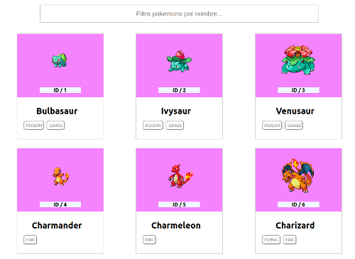

## Pokemons

Webapp sobre Pokemons que muestra un listado de los 25 primeros. Consta de un buscador para poder filtar los pokemons por nombre.

### Pasos para utilizar la aplicación:

1. npm install
2. npm install --save react-router-dom node-sass prop-types
3. npm start

### Desarrollado con:

- React

### Realizado por:

Ana Amaro:

- [GitHub](https://github.com/AnaAmaro)
- [LinkedIn](https://www.linkedin.com/in/anaamarovazquez/)
